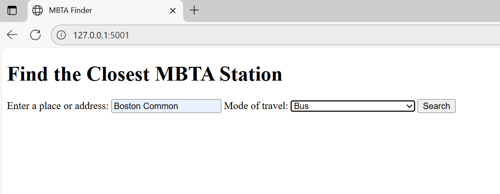
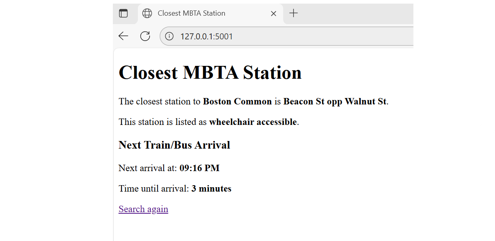
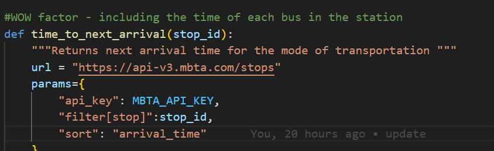
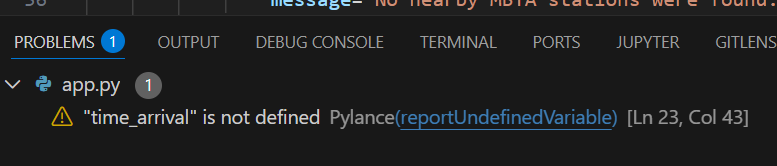

# MBTA-Web-App-Project

This is the base repository for Web App project. Please read the [instructions](instructions.md) for details.

## Team Members
1. Lucia Prado 
2. Nicole Gaige 

### Part 1 - Project Overview 
This project aims to build a simple MBTA Web App, to allow the user to enter a place name or adress and receive the nearest MBTA station possible, within the Boston area. This shows how web API's, backened logis and HTML templates can all create a more dynamic type of web application. Along with the name of the station, the web app also provides the accessibility information of the station that it is closest to the user. In order to achieve this, the web app uses the API of Nominatim which is a Geocoding API that uses the latitude/longitude and the MBTA v3 API to find nearest stop for the user. The core features of this web app are: the input of a place or address from the user, geocoding from place name to coordinates, a lookup function of the neares MBTA station stops based on the location coordinates, a display of accessibility information and error handling for invalid or missing locations based on the users input. The WOW features we included for this project are: real-time MBTA arrival predictions, stop_id extraction & CSS styling, and mode of travel with a dropdown feature. With the core features we were able to implement these new WOW features that allowed us to be a little more creative with our MBTA web app and add useful additional features. Below I have included two images that show the webpage.

# 2. Reflection

The development process of this project was more challenging than what we were expecting due to the multiple files we needed to create and interconnect to get the web app to run. A part that we thought went well when creating the code, was breaking down all of the functions into smaller functions with specific purposes from the beginning such as find_nearest_station() or get_lan_lon(). Making these separate pieces made it so much easier to handle the code and find any errors that needed debuggin such as typos or mistakes in the code, given that we could test each function individually and see which one was the one that needed fixing. 

Whereas what we found the most challenging was working with external API's. When we were creating the functions, we run into several errors that needed debugging, as the url would change based on what the function wanted to do. For example, when using the url for end point predictions I would always use /stops endpoint for predictions, when I needed to change it to /predictions to make the code run (as shown in the image below). We also struggled with the JSON structure when trying to find the predictions endpoint with the MBTA and unpacking return values any time I updated the code. Due to these challenges, we examined each JSON response more carefully and improved the debugging approach throughout the project. Flask routing became another challenge when we were adding the WOW factors into the code, as a lot of functions started showing in the problem section of the terminal as 'not defined' as we accidentaly used the wrong function name (as shown in the second image below). So after those issues, we started being more cautious on the function names that we use, such as going in between documents to copy and paste the names of the functions to avoid any typo mistakes that would affect the code. 

If we were to do the project again, one thing we would change would be to determine which WOW factors we wanted to include before writing the entire code. This is because, when I added them to the pre-existing code, I needed to manually test everything, which was great to identify any potential errors, however, if I knew which codes I wanted to include, we would have added a set of automated tests to prevent errors and debugging processes. For example, it would have been better to introduce the route type feature earlier in the process rather than at the end, as we didnt know where to place it with all the functions we had created before. These would be some things that we would change if we were to redo the entire project again. 

# 2. Teamwork and Division 
For the project we (Lucia and Nicole) met when the assignment was posted to determine how we would break down the project together. Lucia decided she wanted to work on the first part, handling the Geocoding and Web API's, whereas Nicole decided she wanted to work in part three to include all of the WOW factors. Therefore, we decided that Lucia would work on part 1 and the first part of part 2 like the API's the HTML and the templates, and Nicole would complete the remaining of the assignment, such as introducing FlasK, the WOW factors the CSS and whatever needed to be added to complete the project. 

We kept this plan throughout the entire project and it worked really well for us as it allowed us to complete the project in an efficient manner. The main 'communication' issue we had during the project was to open the VS file as a contributor, because it was difficult for the member that didn't fork the repository to access it, after we figured that out we didn't have any other issue when comunicating to complete the project. As we overall had a great time dynamic, such as communication, we all completed the work on time, there is little to change. The only thing we would change to make sure the project would have gotten completed in a more seamless process would have been to add comments on the functions. That way the other member who didn't write the code, and is reviewing the assignment, can understand the reasoning of which code was used for what and what the workflow process was like. But after that, everything else worked great. 

# 3. Learning and Use of AI tools 

This project helped us understand better the role of APIs, JSON data and backened logic and how they all complement each other to work together. This helped us learn how to structure requests, read documentation closely and extract specific JSON responses. As mentioned earlier the MBTA API helped us learn the importance on preventing typos and paying attention to formats so that the function can give accurate results. Also when building the Flask backened helped us understand the workflow of how once the user inserts an input in the HTML webpage, what the process is like to deliver an outcome for the user. This process required a lot of debuggging due to several errors we faced when producing the functions, but testing each function individually and correcting mistakes such like endpoints or wrongly unpacked values were essential to make sure the webpage produced the outputs we wanted it to give to the user.

The main AI tool we used to complete this project was ChatGPT. We used this virtual assistant mainly for troubleshooting and clarifying any error messages we didn't understand or know how to fix (as shown in the image below helping us find errors we couldn't find). Using ChatGPT as a virtual assitant helped us understand how to go about new topics that we didn't know about or understand, like the ISO time parsing. However, we realized we needed to be careful when using ChatGPT because it had some limitations when using it, such as giving us really complex code or suggesting new ideas or codes that were not related to the topic. If we were to restart the project again using the virtual assistant we believe we would give a broad overview of what the project is about to see what it would recommend as the most clear and easy workflow to go about the project, rather than only using it when we don't understand a concept or need to find debugging issues. The use of AI overall was really helpful, however it helped us understand that we cannot fully relly on it, so it is important to understand the main concept of the codes that we use to make sure that the web app could function.

